# 技术亮点与讲解 — PPT 汇报 Timeline 草稿

> 预计时长：6～6.5 分钟
> 叙事结构：以连续追问驱动，每个问题自然引出下一个问题

## 整体视觉风格

- **设计风格**：扁平化（flat design），干净清爽，不使用 3D、阴影或渐变叠加
- **背景**：每页纯白背景（#FFFFFF），不做深色或渐变背景
- **主色调**：蓝色系为主（#3B82F6），搭配浅蓝填充（#DBEAFE）用于高亮区域
- **辅助色**：
  - 绿色（#22C55E / #BBF7D0）：用于"正确方案"、"扩容"等正向内容
  - 红色（#EF4444 / #FCA5A5）：用于"问题"、"传统方案"、"缩容"等警示内容
  - 橙黄（#F59E0B / #FEF3C7）：用于需要特别强调的标注
  - 灰色（#6B7280 / #F3F4F6）：用于次要信息、箭头、辅助线
- **字体**：无衬线字体（如思源黑体 / Noto Sans /苹方），标题 24-28px 加粗，正文 14-16px 常规，图注 12px
- **图标/图形**：圆角矩形，扁平化服务器/流程图标，不使用拟物风格
- **连线/箭头**：实线箭头表示主动调用或正向流程，虚线箭头表示返回或异步
- **页面布局**：统一左右结构为主（左文右图或左图右文），仅在内容不适合左右排布时用上下结构
- **文字密度**：每页正文不超过 5-6 行，每行不超过 25 字，留白充足，详细内容留给口头讲解
- **图表风格**：背景纯白，无网格线，节点用色块填充 + 深色边框，标签简洁

---

## 时间分配总览

| # | 页面 | 时长 |
|---|------|------|
| Q1 | 秒杀系统的痛点是什么？ | 20s |
| Q2 | 加机器就能解决吗？ | 20s |
| Q3a | 现有方案能直接用吗？（竞品定位） | 25s |
| Q3b | 现有方案能直接用吗？（我们的出发点） | 15s |
| Q4 | 横向扩展的前提是什么？ | 30s |
| Q5 | 弱状态下如何抽象资源分配？ | 50s |
| Q6 | 分配逻辑如何做到可插拔？ | 40s |
| Q7 | 秒杀场景下状态怎么放？ | 40s |
| Q8 | 库存扣减和订单写入如何保持一致？ | 30s |
| Q9 | 框架之外，实例数谁来管？ | 20s |
| Q10 | Scaler 凭什么知道该扩容了？ | 40s |
| Q11 | 缩容为什么比扩容谨慎得多？ | 30s |
| 收尾 | 闭环总结 | 20s |
| **合计** | | **约 6:20** |

---

## Q1：秒杀系统的痛点是什么？（0:00 – 0:20）

**布局**：左文右图

**左半区**
- 秒杀开启瞬间，请求量远超服务器处理能力
- 数据库锁争抢、库存超卖、系统崩溃，本质是资源稀缺加高并发竞争

**右半区**

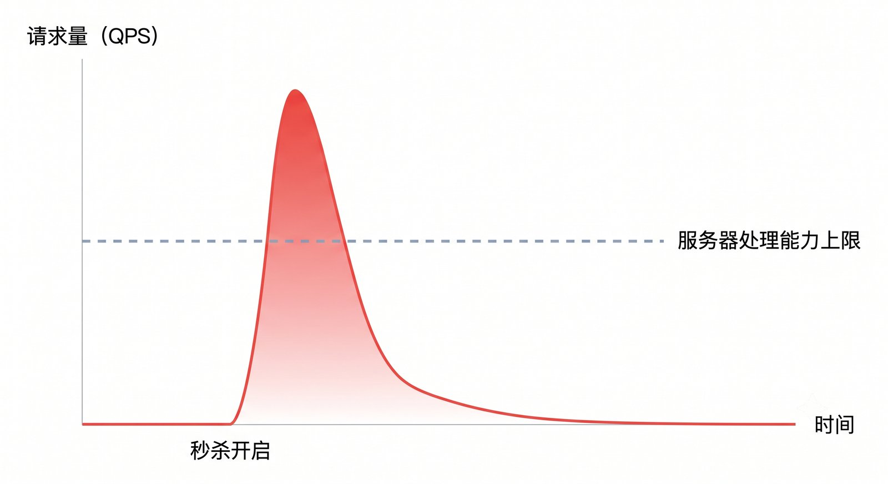

---

## Q2：加机器就能解决吗？（0:20 – 0:40）

**布局**：左图右文

**左半区**

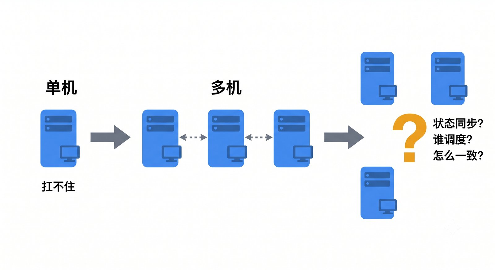

**右半区**
- 加机器是对的，也就是横向扩展（Scale Out）
- 但多台机器带来了新问题：怎么协作？状态放哪？谁来调度？
- 这才是我们这个项目真正要解决的事

---

## Q3a：现有方案能直接用吗？（竞品定位）（0:40 – 1:05）

**布局**：上半区表格，下半区定位坐标图

**上半区**：竞品对比表格

| 方案 | 部署复杂度 | 资源分配抽象 | 自治伸缩 |
|------|-----------|-------------|---------|
| K8s + HPA | 重型 | 无（实例级调度） | 有 |
| Sentinel / Resilience4j | 轻量 | 无（仅流量控制） | 无 |
| Prometheus + Webhook | 轻量 | 无（工具链拼接） | 半手工 |
| **singularity-core + scaler** | **轻量** | **Slot / Actor / Allocator** | **内聚决策** |

**下半区**

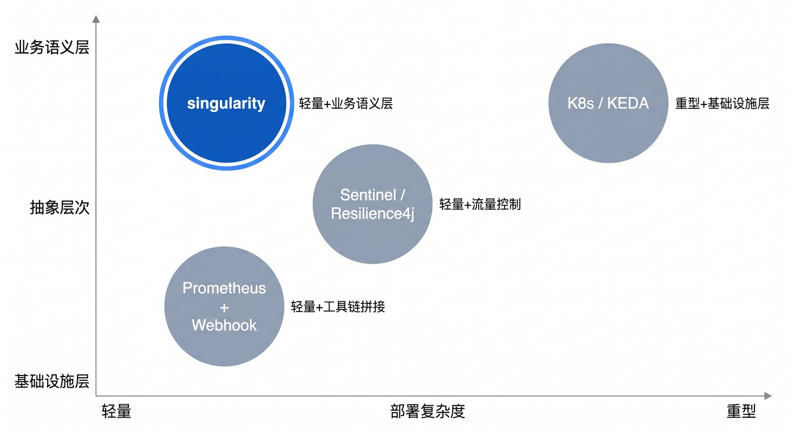

---

## Q3b：现有方案能直接用吗？（我们的出发点）（1:05 – 1:20）

**布局**：左文右图

**左半区**
- 轻量部署 + 业务语义层的资源分配，这个组合在现有生态里是空白
- 这就是我们设计 singularity-core 和 singularity-scaler 的出发点
- 两个模块从一开始就是联动设计的，不是各自做完再拼在一起

**右半区**

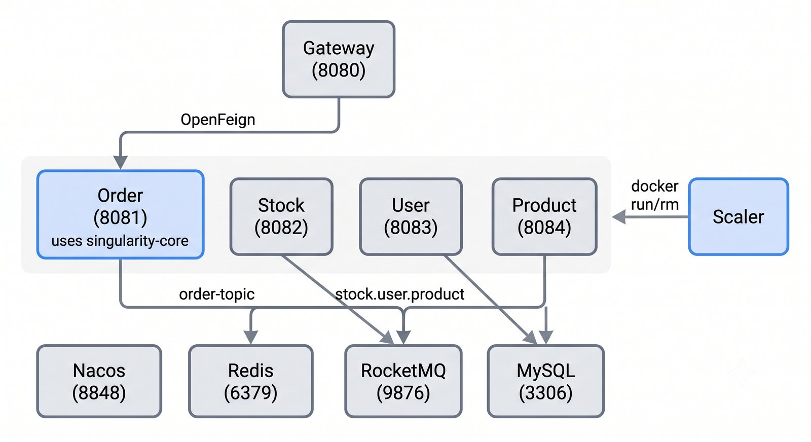

---

## Q4：横向扩展的前提是什么？（1:20 – 1:50）

**布局**：左右对比

**左半区（强状态）**
- 本地保存跨机器共享的状态（比如库存计数）
- 每台机器看到的数据不一样，结果不一致
- 这种情况加再多机器也没用

**右半区（弱状态）**
- 本地不保存需要跨机器共享的关键状态
- 业务可以接受一定程度的最终一致性
- 状态交给 Redis、MySQL、MQ 这些共享基础设施

---

## Q5：弱状态下如何抽象资源分配？（1:50 – 2:40）

**布局**：左半区概念卡片，右半区流程图

**左半区**：3 个核心概念卡片

**Slot** — 资源桶
- 系统里有限的资源被切成若干桶
- 每桶有自己独立的状态（比如一个 Redis 计数器）

**Actor** — 请求者
- 每个进来的请求，携带身份和元数据
- 作为 Allocator 的入口参数

**Allocator** — 唯一入口
- `allocate(Actor) → Result`
- 框架只负责把正确的请求送到正确的桶，至于分配之后怎么改变状态，那是业务的事

**右半区**

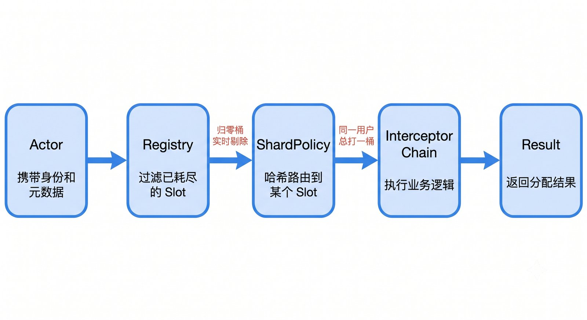

---

## Q6：分配逻辑如何做到可插拔？（2:40 – 3:20）

**布局**：上半区拦截器链示意，下半区 FraudDetection 实战

**上半区**

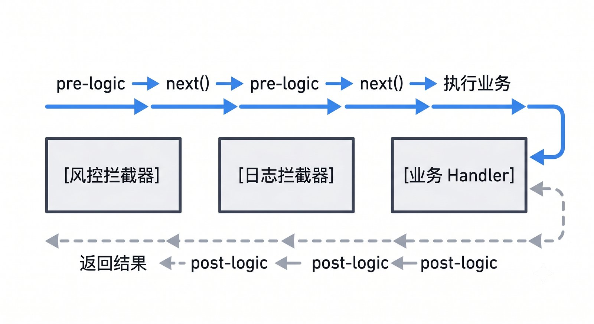

**下半区**：FraudDetectionInterceptor 实战
- 计算每个用户的 4 维行为特征哈希：请求频率、时间窗口、Slot 偏好、跨桶切换
- 风险分超过阈值就拦截，不进入库存扣减流程
- 这个拦截器有意设计为 CPU 密集型，用来触发 Scaler 扩容

---

## Q7：秒杀场景下状态怎么放？（3:20 – 4:00）

**布局**：左右对比

**左半区（传统方案）**

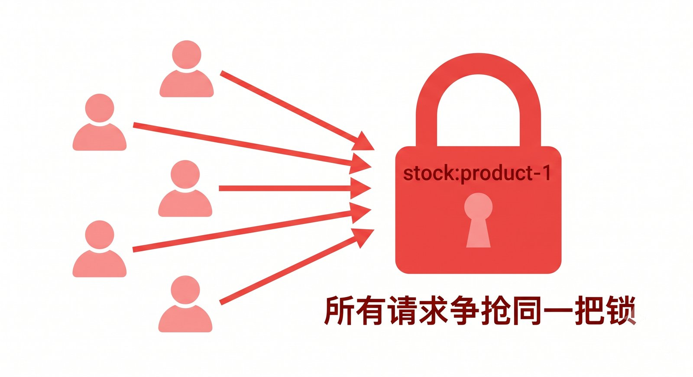

- 单一全局库存锁，所有请求争抢同一把锁
- 并发瓶颈集中，吞吐量上不去

**右半区（Slot 分桶）**

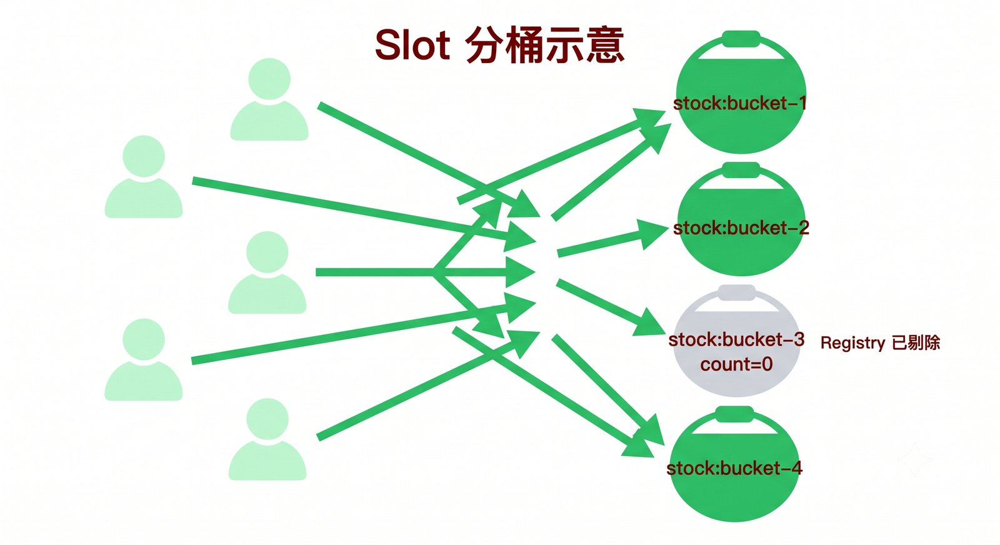

- 库存分散到多个桶，哈希分流让并发压力分摊
- 某个桶计数器归零了，Registry 实时把它从可用列表剔除，后续请求不再打过来

---

## Q8：库存扣减和订单写入如何保持一致？（4:00 – 4:30）

**布局**：上半区时序图，下半区关键点

**上半区**

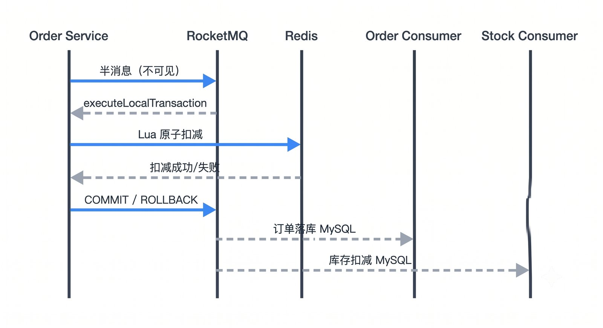

**下半区**：三个关键点
- Redis Lua 脚本做原子扣减
- 进程崩溃时 Broker 主动回查 Redis，决定补偿提交还是丢弃
- 整个链路不需要两阶段提交，靠消息队列实现最终一致性

---

## Q9：框架之外，实例数谁来管？（4:30 – 4:50）

**布局**：左文右图

**左半区**
- 框架本身不管实例数，那不是它的职责
- 但流量高峰来了，一台机器 CPU 被打满，再好的框架也没用
- 所以我们需要一个能感知压力、自动增减实例数的服务，也就是 singularity-scaler

**右半区**

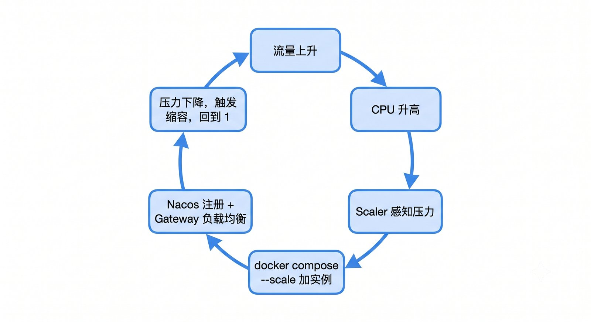

---

## Q10：Scaler 凭什么知道该扩容了？（4:50 – 5:30）

**布局**：上半区双路对比图，下半区触发条件

**上半区**

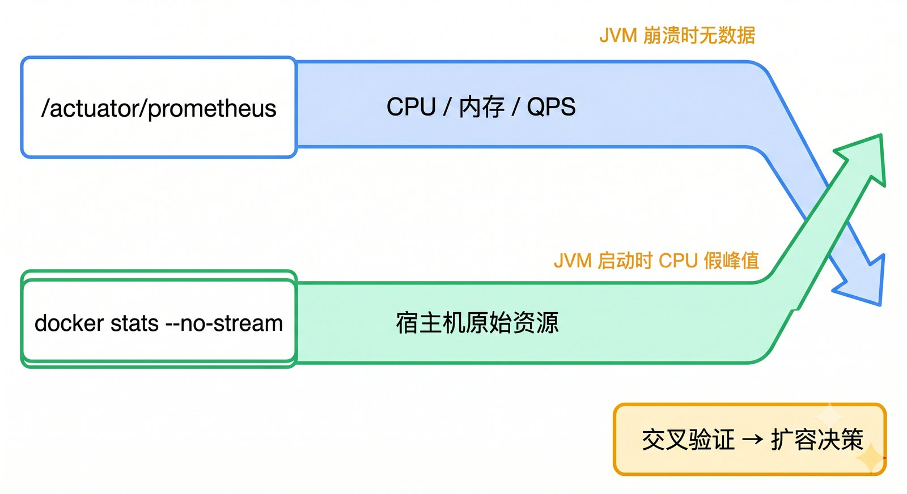

**下半区**：触发条件（2 张卡片）
- 条件 1：任意一路 CPU 超过 70%，立即加一个实例
- 条件 2：15 秒内 CPU 急升超过 38 个百分点，也立即加实例

---

## Q11：缩容为什么比扩容谨慎得多？（5:30 – 6:00）

**布局**：左半区三道门槛（竖向堆叠卡片），右半区时间线

**左半区**：缩容三道门槛
1. 连续 3 个采样周期（约 45 秒）所有指标都低于下限，确认不是偶发低谷
2. Docker CPU 也必须低于阻断阈值，因为 JVM 指标可能因为 GC 暂停而虚低，而 Docker 层面的 CPU 数据更可靠
3. 新容器有 90 秒冷静期，JVM 启动时 CPU 天然高，这段时间的数据不参与缩容判断

**右半区**

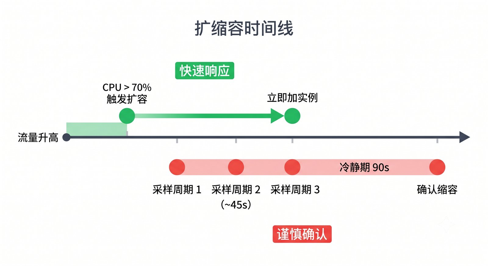

底部标注：扩容宁可多扩，代价只是多花一点资源；缩容缩错了直接影响可用性。所以扩容快、缩容慢，这是有意为之的非对称设计

---

## 收尾：闭环总结（6:00 – 6:20）

**布局**：全幅闭环流程图 + 底部一句话

**主区域**

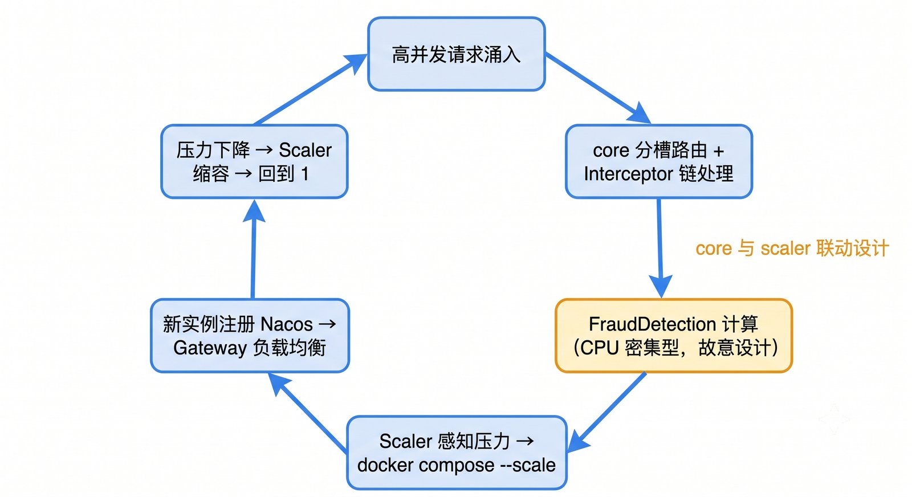

**底部加粗**
singularity-core 和 scaler 的设计都是通用的，秒杀只是我们选择的极端验证场景。任何需要横向扩展资源分配的系统，都可以套用这套框架。

---

## 讲解注意事项

- **Q3a 是需求分析的闭环**，如果时间紧可以压缩为一句"现有方案要么太重要么只做流量保护，轻量+业务语义层是空白"，但如果评委对竞品有疑问，这里有表格和坐标图可以展开
- **风控拦截器的 CPU 密集型是故意的**，现场主动点出这个设计意图，展示 core 和 scaler 的设计是刻意联动的，而不是两个独立模块碰巧拼在一起
- Q8（分布式事务）可以根据时间压缩为一句话："RocketMQ 半消息 + Redis 原子操作，Broker 负责崩溃补偿"，不展开细节
- 如果有 demo 环节，接在收尾之后，展示 Scaler 日志或 Prometheus 面板的实时扩缩容过程，效果最佳

---

## 附录：评委追问预案 — 竞品详细分析

> 以下内容不在主线叙事中展开，仅在评委追问时参考使用。

### 一、与 K8s 的对比

K8s 确实能做这些事。HPA（Horizontal Pod Autoscaler）和 VPA（Vertical Pod Autoscaler）在生产环境中已经是成熟方案：

- **横向扩展（Scale Out）**：HPA 根据 CPU、内存或自定义指标自动增减 Pod 副本数，和你们 Scaler 做的事情本质一样；
- **服务发现与负载均衡**：K8s 内置 Service + Ingress，新 Pod 起来自动纳入流量，对应你们的 Nacos + Gateway；
- **滚动发布与健康检查**：Readiness Probe 确保新实例就绪后才接流量，类似你们 Scaler 里的 90 秒冷静期逻辑；
- **资源隔离**：通过 namespace、resource limit、QoS class 做到比 Docker Compose 更精细的资源管控。

所以如果有人问"K8s 能不能做"，答案是：**能，而且功能更全**。但这不是弱点，这恰恰是要讲清楚的设计边界。

#### 1. 运维复杂度天壤之别

K8s 是一套完整的容器编排平台，光是搭一个生产可用的集群，就需要处理：etcd 高可用、API Server 配置、CNI 网络插件、CSI 存储插件、RBAC 权限体系、Helm Chart 管理……一个中小团队或者课程项目，光配置文件就能把人淹没。

我们的方案是：**一个 `docker-compose.yml` + 一个 Scaler 进程**，在单机或小规模环境下直接跑起来，没有额外的控制平面，没有 etcd，没有 kubelet。运维成本接近于零。

#### 2. 指标采集逻辑完全可控

K8s HPA 的默认指标来自 metrics-server，扩展自定义指标需要接 Prometheus Adapter，配置相对繁琐，而且触发逻辑是固定的阈值模型，调整需要改 YAML 再 apply。

我们的 Scaler 直接从 **JVM Actuator + Docker Stats 双路采集**，触发逻辑写在代码里，比如"15 秒内 CPU 急升超过 38 个百分点立即扩容"这种**速率感知**的逻辑，在 HPA 的标准配置里是做不到的，需要额外写 custom metrics provider。

#### 3. 双路交叉验证是独特设计

K8s 的 HPA 通常依赖单一指标源，而我们**同时跑 JVM 指标和 Docker Stats，互为 fallback 和校验**。JVM 崩了 Docker 还在，JVM 启动假峰值被 Docker 数据压制。这种"两路交叉验证才做决策"的思路，在工业级系统里有真实价值。

#### 4. singularity-core 的资源抽象是 K8s 层面没有的

K8s 解决的是**实例层面的调度**，不知道业务里有"库存桶"这个概念。而 singularity-core 的 Slot/Actor/Allocator 模型，是在**业务语义层面**做资源抽象，把高并发的资源争抢问题建模成可插拔的分配框架。两者根本不在同一个抽象层上。

K8s 管的是"这台机器上跑几个容器"，我们的框架管的是"这个请求该被路由到哪个库存桶、经过哪些拦截器处理"。

#### 5. FraudDetection + Scaler 的联动是刻意设计的闭环

风控拦截器被设计成 CPU 密集型，目的就是**主动制造可被 Scaler 感知的压力信号**。这种 core 和 scaler 之间有意识的联动设计，是一个系统性思考的体现。K8s 生态里也可以做类似的事，但需要在应用层和基础设施层之间搭一套自定义的信号传递机制，反而更复杂。

#### 答辩口径

> K8s 是为大规模生产集群设计的重型基础设施，我们的方案是为**轻量部署场景**设计的自治调度框架。在不引入 K8s 运维复杂度的前提下，实现了同等核心能力，并且在业务语义层（资源分配抽象、双路指标交叉验证）做了 K8s 本身不覆盖的工作。

---

### 二、与 Sentinel / Resilience4j 的对比

#### 资源分配层

**Sentinel（阿里开源）**是目前国内最主流的流量治理框架，功能覆盖限流、熔断、降级、热点参数限流。它和我们的 core 在**拦截器链**这个设计上高度相似，Sentinel 也是基于 Slot Chain 的责任链模式，每个 Slot 负责一类逻辑（统计、限流、熔断……），和我们的 Interceptor 链 around 语义几乎是同一个思路。

但区分度非常明显：**Sentinel 的 Slot 是流量控制语义的，不是资源分配语义的**。Sentinel 告诉你"这个请求能不能通过"，而我们的 Allocator 告诉你"这个请求应该被分配到哪个资源桶"。Sentinel 没有 Slot（资源桶）+ Actor（请求者）+ Registry（可用桶过滤）这一套业务语义建模，它是纯粹的流量闸门，不做路由分配。

另外 Sentinel 没有内置的 ShardPolicy 概念，同一用户哈希到同一桶、跨桶切换行为作为风控特征，这些都是我们框架独有的设计。

**Resilience4j** 是 Spring 生态里对标 Hystrix 的熔断限流库，功能上和 Sentinel 类似，也是做流量保护的。设计更偏 Java 函数式风格，通过装饰器模式包装业务调用。和我们的区分度与 Sentinel 基本一致，**它是保护性的流量控制，我们是分配性的资源路由**，两者解决的问题根本不同。

#### 弹性伸缩层

**Spring Cloud + Ribbon/LoadBalancer 全家桶**本身不做自动扩缩容，它解决的是服务注册发现、配置中心、负载均衡。我们用了 Nacos 做服务注册，这本身就是 Spring Cloud 生态的一部分。但 Spring Cloud 没有 Scaler，它假设实例数是由外部管理的。**我们的 Scaler 填补的正是这个空白**。

**KEDA（Kubernetes Event-Driven Autoscaling）**是 K8s 生态里专门做事件驱动扩缩容的组件，比 HPA 更灵活。但 KEDA 仍然依赖 K8s 控制平面，而我们的 Scaler 是独立进程，直接调 Docker API，无需任何编排平台。

**Prometheus + Alertmanager + 自定义 Webhook**是很多团队在没有 K8s 时的手工替代方案，和我们的 Scaler 在能力上最接近。但它是**松散的工具链拼接**，没有冷静期、双路交叉验证、缩容三道门槛这些内聚的决策逻辑。

---

### 三、定位坐标图

用两个维度定位：横轴是**部署复杂度（轻量 → 重型）**，纵轴是**抽象层次（基础设施层 → 业务语义层）**：

- **K8s / KEDA**：重型 + 基础设施层
- **Sentinel / Resilience4j**：轻量 + 流量控制层（不做资源分配）
- **Prometheus + Webhook 方案**：轻量 + 散装工具链（无内聚决策逻辑）
- **我们的框架**：轻量部署 + 业务语义层的资源分配抽象 + 内聚的自治伸缩决策

> **这个位置在现有开源生态里没有直接竞品，正是框架存在的合理性。**
